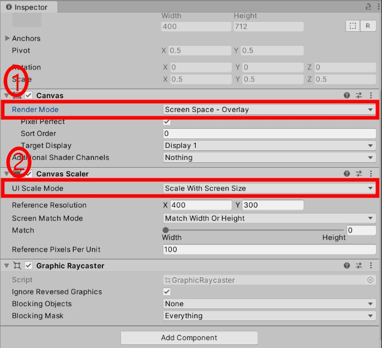
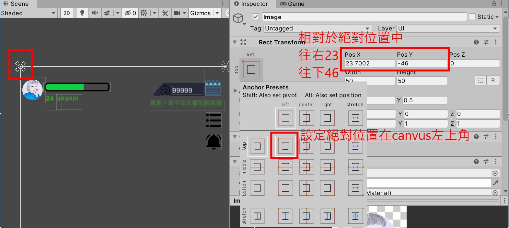

### 主題 : UNITY簡易排版
#
>### 設定
####  因手機尺寸大小不依，canvus需做自適應設定。
  
</ br>

>### 重點
#### 排版關鍵-瞄點
1.專業講解

http://blog.fourdesire.com/2018/07/03/%E6%88%90%E7%82%BA-ugui-%E7%9A%84%E6%8E%92%E7%89%88%E5%A4%A7%E5%B8%AB-%E4%B8%80%E6%AC%A1%E7%B2%BE%E9%80%9A-recttransform/  

2.懶人包
>設置瞄點就類似於設定一個點為絕對位置(稱瞄點)，物件排版以絕對位置中的相對位置做排版。

#### 排版順序
1. 在hierarchy處點選右鍵新增UI選插入圖片或文字..
2. 判斷瞄點該設置何處，EX:物件放右上方，將瞄點設置於右上方，改變手機尺寸時物件才不會跑版
3. 先設置物件長寬後再來設置POS X、POS Y 來調整相對位置到相對應的地方。

>#### 報告歷程

1. 錯誤一
> unity安裝版本錯誤，canvus內右鍵點不出UI功能
2. 錯誤二
> 沒有設置好自適應，一改手機尺寸馬上跑版(沅平大大告知錯誤後更改)
3. 錯誤三
>未設定物件長寬，先設定位置後才改大小，位置跟著跑版
4. 嘗試一
> 將需排版的物件用PHOTOSHOP去背(抖M大大告知)
5. 嘗試二
> 物件相疊時，改變canvus內順序，檔案愈上面畫布中愈底層(marie大大告知)
6. 嘗試三
> 試著玩一下unity做類似瑪莉歐的場景跳跳，C#看不太懂，失敗.....

### 總結 
unity排版不至於太複雜，認識設置和瞄點後排版上都會比較順手，讓剛下載unity的朋友能更快認識排版技巧，自己之後在格格拍有需要排版時也能夠加順手，報告完畢!!!