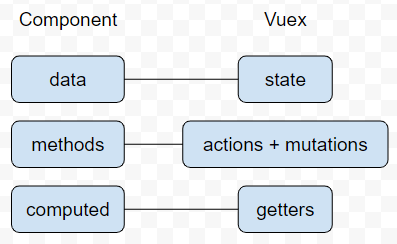

## 何謂VUEX?

### VUEX基本定義
Vuex 是一個專為 Vue.js 來做使用的狀態管理模式與文庫，它作為應用程序中所有組件的集中存儲區，並在規則下確保只能以可預測的方式對狀態進行變更

### 為什麼要花時間介紹VUX?
因為前端頁面目前以VUE來寫的話方便許多!但重點是如果要把那些功能移植到下一個CASE時，目前來說並不這麼容易，而要將那些**功能模組化是必要的**，需使用到component。

#### 原始compnent傳值方式
>1. 父組件傳遞參數給子組件 : props
>2. 子組件要發送事件的地方使用 $emit(“事件名稱”, “要傳遞的值”) 將參數傳遞給父組件
>3. 由於 Vue 中的組件都是各自獨立的，此時我們需要借助一個空的 Vue 做為橋樑

>> 解決了阿!沒問題了阿!用這個傳不就好了?我原本也是這樣想的!
但...看了VUE3的部分....這個原始傳值的部分被拔掉了呢!那怎傳?怎溝通?

### 答案還是請使用VUEX!謝謝! :)

## 中段呼應主題，何謂VUEX?
白話來說VUEX就像是一台主機，而主機上的資料能被各個使用者(component)使用，並改動主機上的值，互相傳遞上是方便容易的!例如商城上像是**購物車**，或是**促銷模組**都能做成component，下個案子能夠迅速的完成!!!

## VUEX結構State、Mutations、Actions、Getters
>1. Vuex 使用單一狀態樹，這是一個物件包含了全部應用層的狀態與供應單一數據來源 (Single source of truth)，這代表通常你每個應用只會有一個 store 。單一狀態樹讓我們可以直接指定 state 其中的一項並讓我們能夠輕鬆的得到目前應用程式的狀態與快照 (snapshots)

>2. 提交 mutations 是改變 Vuex 中 store 的唯一方式。 mutations 非常類似於組件中的事件（event），每個 mutation 都有一個字串的  事件類型 (type) 和一個回調函數 (handler)， handler 就是我們實際進行狀態更改的地方，並且他會接受 state 作為第一個參數

>3. Actions 類似於 mutations，但仍然有些不同： Action 提交（commit）的是 mutations ，而不是直接變更 state。 Actions 可以包含任意異步操作

>4. Getters就像是VUE內的computed能立即改變state內的值

#### 對照圖一

#### 對照圖二
